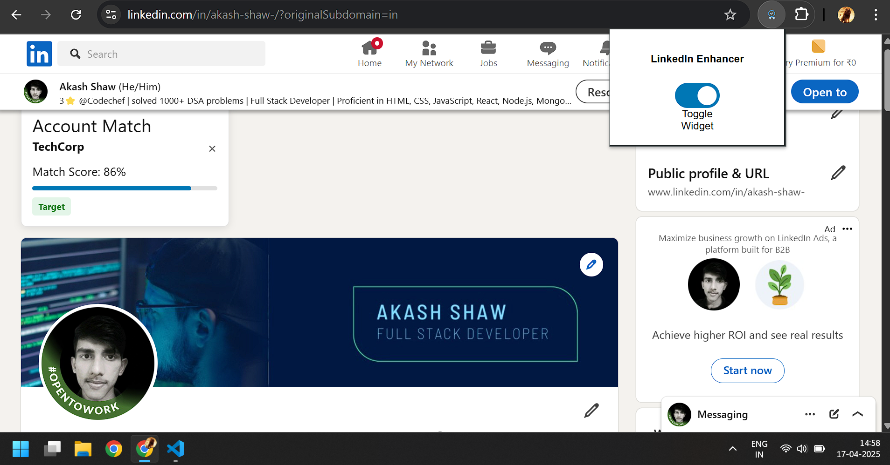

# LinkedIn Profile Enhancer Chrome Extension

  
*(Replace with your actual screenshot path)*

## 📌 Overview
A Chrome extension that adds a widget to LinkedIn profiles showing:
- Company name
- Match score (0-100)
- Account status ("Target" or "Not Target")

## ✨ Features
- **Floating widget** on LinkedIn profiles
- **Toggle on/off** functionality
- **Persistent settings** (remembers your preference)
- **Clean UI** with progress bar and status tags

## 🛠 Installation
1. Download or clone this repository
2. Open Chrome and go to:

chrome://extensions/

3. Enable "Developer mode" (toggle in top-right)
4. Click "Load unpacked"
5. Select the extension folder

## 🖥️ How It Works
### Widget Displays:
| Component       | Description                          |
|-----------------|--------------------------------------|
| Company Name    | Displayed in bold text               |
| Match Score     | Percentage with progress bar         |
| Account Status  | Colored tag (green/red)              |

### Data Flow:
1. Popup toggle → Chrome storage
2. Content script → Injects widget into LinkedIn
3. Background script → Manages storage

## 📂 File Structure

linkedin-enhancer/
├── icons/
├── popup/
│ ├── popup.html
│ ├── popup.css
│ └── popup.js
├── styles/
│ └── widget.css
├── content.js
├── background.js
└── manifest.json

