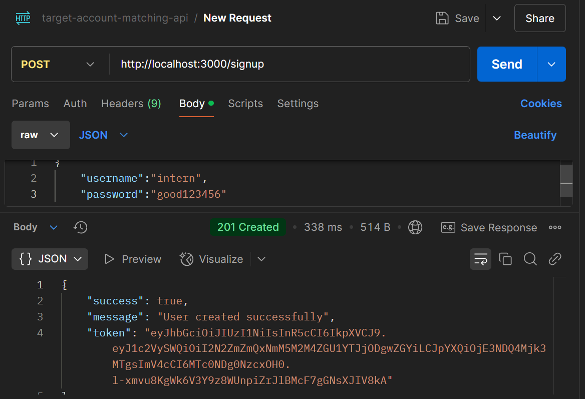
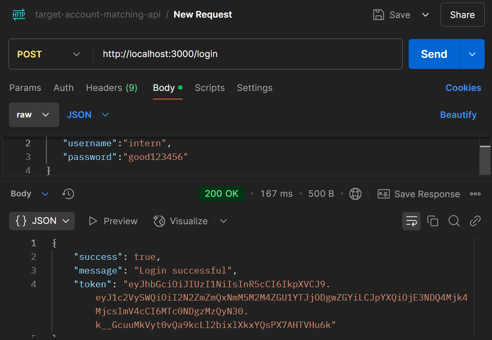
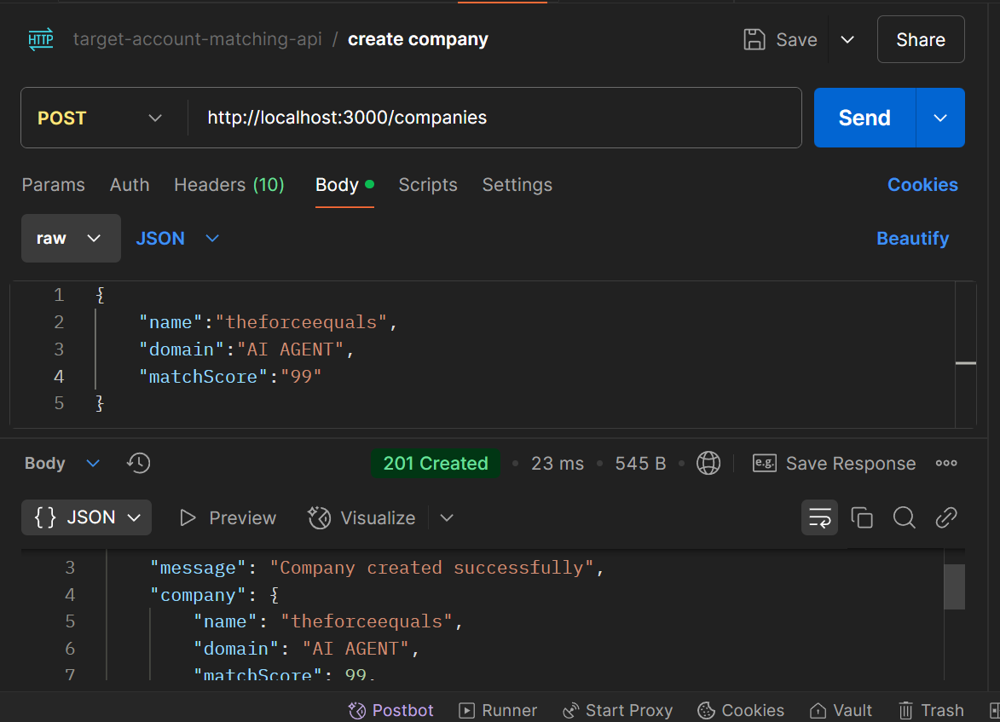
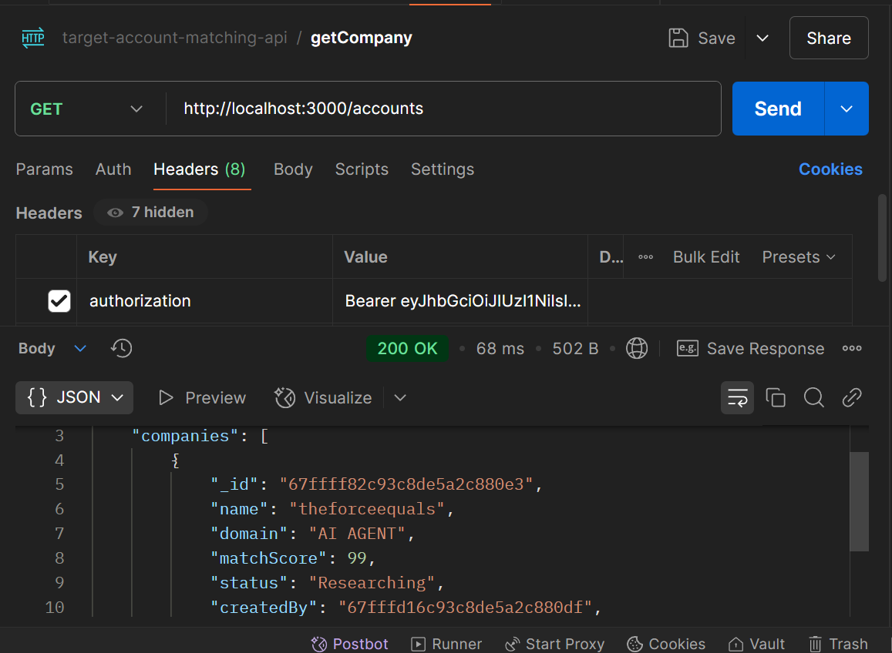
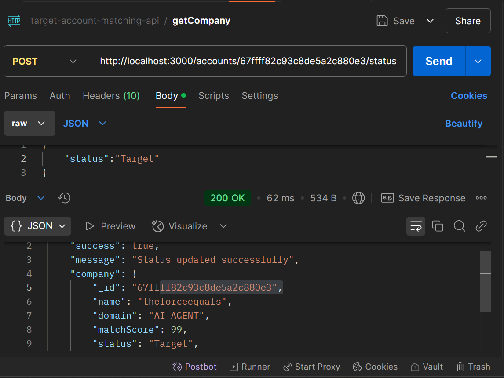

# Target Account Matching API

## 🚀 Quick Start

git clone https://github.com/yourusername/target-account-api.git
cd target-account-api
npm install
echo "MONGODB_URI=mongodb://localhost:27017/accountMatching
JWT_SECRET=your_secure_secret
PORT=3000" > .env
npm start

## 🔑 Authentication

### Signup

POST /signup
Content-Type: application/json
{
  "username": "admin",
  "password": "secure123"
}

### Login

POST /login
Content-Type: application/json
{
  "username": "admin",
  "password": "secure123"
}

## 💼 Company Management

### Create Company

POST /companies
Authorization: Bearer <token>
Content-Type: application/json
{
  "name": "TechCorp",
  "domain": "techcorp.com",
  "matchScore": 85
}

### Get All Companies

GET /accounts
Authorization: Bearer <token>

### Update Status

POST /accounts/:id/status
Authorization: Bearer <token>
Content-Type: application/json
{
  "status": "Target"
}

